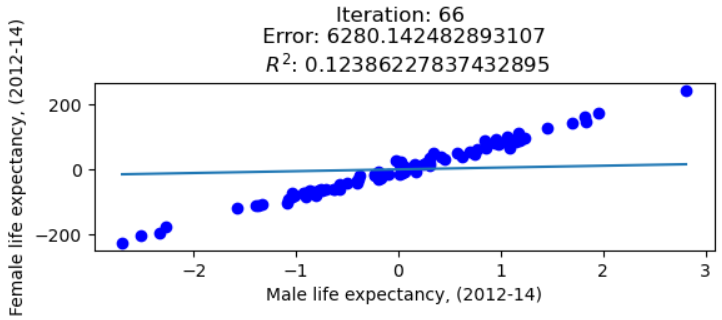

# Data Mining Techniques 

Welcome to the Data Mining Techniques repository! Here, you'll find a diverse collection of notebooks showcasing various data mining techniques implemented in Python. The repository covers fundamental concepts like linear models, nominal data classification, clustering, statistical modeling, and text mining.

The notebooks in this repository provide a hands-on introduction to data mining techniques, along with practical examples to help you understand how these techniques work. Whether you're new to data mining or looking to expand your knowledge, you'll find something of interest here.

Let's dive in and explore the world of data mining techniques together!

## Topics

1. [Linear Models](#linear-models)
    - [Linear Classification](#linear-classification)
    - [Linear Regression](#linear-regression)
2. [Nominal Data Classification](#nominal-data-classification)
    - [OneR (1R) Algorithm](#oner-1r-algorithm)
    - [Logistic Regression](#logistic-regression)
    - [Decision Tree Classification](#decision-tree-classification)
    - [K-Nearest Neighbors (KNN)](#k-nearest-neighbors-knn)
3. [Clustering](#clustering)
    - [Agglomerative Clustering](#agglomerative-clustering)
    - [DBSCAN](#dbscan)
    - [K-means Clustering](#k-means-clustering)
4. [Statistical Modeling](#statistical-modeling)
    - [Gaussian Mixture](#gaussian-mixture)
    - [Instance-Based Learning](#instance-based-learning)
5. [Text Mining](#text-mining)
    - [Text Classification](#text-classification)
    - [Text Clusterization](#text-clusterization)

## Installation

1. Clone the repository.
    ```shell
    git clone  git@github.com:SantiagoCalderon1999/DataMining.git
    cd DataMining
    ```
2. Ensure you have Python 3.8 or higher installed on your local machine.
3. Install the required dependencies.
    ```shell
    pip install -r requirements.txt
    ```

4. Dive into the notebooks at your liking!

## Linear Models

Linear models are versatile tools suitable for regression tasks on linear datasets or classification on linearly separable datasets.

### Linear Classification

Explore linear classification techniques. We generate two clusters of data randomly, each drawn over a straight line, and separate them using the Perceptron algorithm.

[Explore Linear Classification](linear_models/linear_classification.ipynb)

### Linear Regression

Delve into linear regression using Gradient Descent. We implement Gradient Descent on the London borough profiles dataset to predict the maximum.



[Explore Linear Regression](linear_models/linear_regression.ipynb)

## Nominal Data Classification

Discover algorithms tailored for classifying nominal data, offering insights into their applications and effectiveness.

### OneR (1R) Algorithm

Generate rules for pairs of `sepalLength` and `sepalWidth` values within the iris dataset, providing a straightforward approach to nominal data classification.

[Explore OneR Algorithm](classification_nominal_data/one_r_algorithm.ipynb)

### Logistic Regression

Model the probability of categorical outcomes, suitable for nominal data analysis, as implemented for the iris dataset.

[Explore Logistic Regression](classification_nominal_data/logistic_regression_classifier.ipynb)

### Decision Tree Classification

Present decision tree classifiers for both the iris and adult datasets, showcasing their versatility in nominal data classification.

[Explore Decision Tree Classification](classification_nominal_data/decision_tree_classifier_adult_dataset.ipynb)

### K-Nearest Neighbors (KNN)

Classify data points based on the most common class among their K nearest neighbors, demonstrated for the iris dataset with performance evaluation using various metrics.

[Explore KNN](classification_nominal_data/decision_tree_classifier_iris_dataset.ipynb)

## Clustering

Discover various clustering techniques and analyze their metrics.

### Agglomerative Clustering

Agglomerative clustering is a hierarchical clustering technique where each data point starts as its own cluster and then merges with other clusters based on some similarity metric. In the notebook, you will find the implementation of this algorithm and the analysis of its metrics.

[Explore Agglomerative Clustering](clustering/agglomerative-clustering.ipynb)

### DBSCAN

DBSCAN (Density-Based Spatial Clustering of Applications with Noise) is a density-based clustering algorithm that groups together points that are closely packed, marking points as outliers if they lie alone in low-density regions. In the notebook, you will find the implementation of this algorithm and the analysis of its metrics.

[Explore DBSCAN](clustering/dbscan-clustering.ipynb)

### K-means Clustering

K-means clustering is a popular partitioning clustering algorithm. It randomly initializes centroids and iteratively assigns data points to the nearest centroid, then updates centroids based on the mean of all points assigned to them. 

In this notebook, you can explore an implementation of the k-means clustering algorithm from scratch. Additionally, you can compare its results with the k-means clustering algorithm implemented in scikit-learn. Evaluation metrics such as Calinski-Harabaz index, Silhouette score, and Within Cluster Similarity are computed for comparison.

[Explore K-means Clustering](clustering/k-means-clustering.ipynb)

## Statistical Modeling

### Gaussian Mixture

Gaussian Mixture Models (GMM) are probabilistic models that assume all the data points are generated from a mixture of several Gaussian distributions with unknown parameters. They are often used for clustering and density estimation tasks.

[Explore Gaussian Mixture](statistica_modelling/gaussian-mixture.ipynb)

### Instance-Based Learning

Instance-Based Learning (IBL), also known as lazy learning, is a type of machine learning where the system learns by memorizing the instances from the training data. It makes predictions based on the similarity of new instances to the stored instances.

[Explore Instance-Based Learning](statistical_modelling/instance-based-learning.ipynb)

## Text Mining

### Text Classification

A Multinomial Naïve Bayes classifier is used to predict whether an email is spam or not.

[Explore Text Classification](text_mining/text_classification.ipynb)

### Text Clustering

Texts are clustered based on Euclidean distance and cosine similarity of their frequency term document matrix.

[Explore Text Clustering](text_mining/text_clusterization.ipynb)