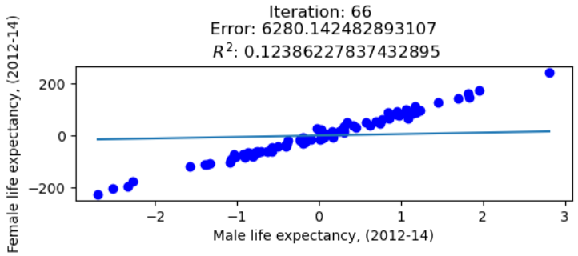

# Data Mining Techniques 

Welcome to the Data Mining Techniques repository! Here, you'll find a collection of notebooks showcasing various data mining techniques implemented in Python.

## Getting Started

1. Make sure you have Python 3.8 or higher installed on your local machine.
2. Install the required dependencies.

```shell
pip install -r requirements.txt
```

3. Explore the notebooks at your liking!

## Linear Models

### Linear Classification
In this notebook, we delve into linear classification techniques. We generate two clusters of data randomly, each drawn over a straight line. Then, we separate these clusters using the Perceptron algorithm.

### Linear Regression
Explore linear regression using Gradient Descent! We start by manually implementing Gradient Descent on the London borough profiles dataset to predict the maximum.



Feel free to explore and experiment with the provided notebooks! Happy mining!